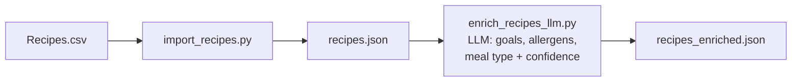
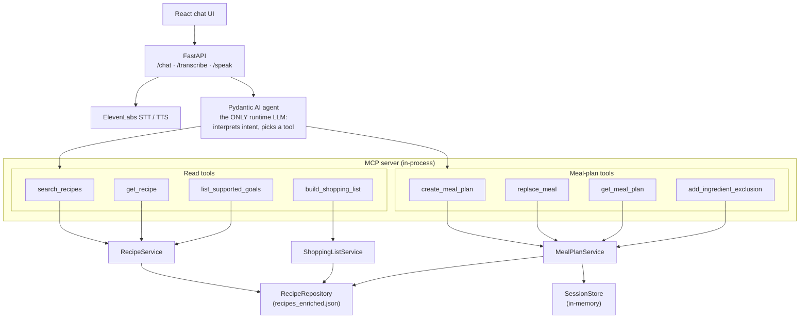

# Chef in My Pocket — System Design

## High-level architecture

### Data pipeline (recipes classification, enrichment)

Recipes are classified **once** by an LLM into fixed tags with a
confidence score (low confidence ⇒ flagged for review); results are
cached and loaded by the runtime at startup.

### Runtime — per user request

Read tools are stateless lookups; meal-plan tools mutate session state via
load → service → validate → save, so a failed call keeps the previous
valid plan. The `session_id` is force-injected — never chosen by the model.

## Key technical choices

### Agent framework
**Pydantic AI.** Simple and complete out of the box: connects an LLM, lets
the model pick tools, validates outputs with Pydantic, and includes an MCP
client — so I could focus on app logic instead of agent plumbing. LangGraph
would be overkill: it's built for multi-agent workflows with graphs of
nodes and shared state, while this app is one agent picking one tool per
request — there is no flow to orchestrate.

### MCP server
**Official MCP SDK.** Pydantic AI can only *consume* MCP tools, not serve
them. The official SDK also keeps the tool layer independent — any MCP
client can use it, not just my agent.

### LLM model
**`gpt-5-mini`.** The runtime LLM only interprets user intent and picks a
tool — all business logic is deterministic Python — so a small, fast,
cheap model is enough. It's a config value (`CHAT_AGENT_MODEL`), so
swapping models is a one-line change.

### Recipe classification
Source recipes are raw Czech text with no tags. Each recipe is classified
once, offline, by an LLM into a fixed set of tags (dietary goals,
allergens, meal type) with a confidence score; low confidence is flagged
for review. Runtime search is then a deterministic filter over
pre-classified data — fast, cheap, no LLM call per search.

### The LLM does reasoning only
The LLM only understands the user and picks the right tool; searching,
planning, validating and saving are deterministic Python. Each tool
validates its input and result before saving (a failed call keeps the
previous valid plan), so the LLM can misunderstand but can't corrupt
state, invent recipes, or break the plan's rules.

### Storage: JSON + Repository Pattern (no database)
100+ read-only recipes don't need a database — a JSON file in memory does
the job and let the POC test the hypothesis fast. All data access goes
through interfaces (`RecipeRepository`, `SessionStore`), so swapping in
Postgres/Redis later is just a new implementation — services, MCP tools
and the agent stay untouched.

## Limitations & next steps
- **Durable storage.** Sessions are in-memory and recipes live in JSON;
  Redis/Postgres slot in behind the existing protocols.
- **No auth.** The API trusts any session id; production needs user
  accounts and per-user session ownership.
- **No streaming.** Responses arrive as one block; streaming would improve
  perceived latency.
- **Data gaps.** No quantities or nutrition in the dataset, so goals like
  high-protein are ingredient-based approximations.
- **Single voice vendor.** STT/TTS are ElevenLabs-only; a second vendor
  (e.g. OpenAI) behind the existing protocols would improve reliability.

## Observed problems
- **Voice transcription quality.** Czech speech-to-text is often
  inaccurate and auto language detection picks the wrong language.
  Pinning `CHAT_STT_LANGUAGE` (default `cs`) mitigates it, but accuracy
  is still poor — needs a better STT model or a second vendor behind the
  `SpeechTranscriber` protocol.
- **UX** is rough and can be significantly improved.
